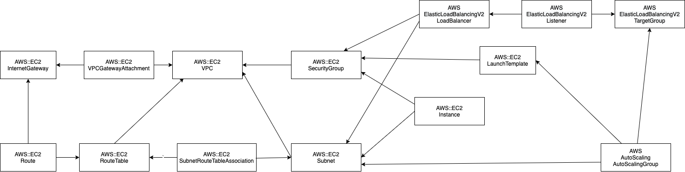

# 課題2
CloudFormationとansibleを利用して課題1のシステムの構築を自動化する。
* [CloudFormation](https://docs.aws.amazon.com/ja_jp/AWSCloudFormation/latest/UserGuide/Welcome.html)
* [ansible](https://docs.ansible.com/ansible/latest/index.html)

# 全体構成


# 作業手順
1. ネットワーク & テンプレートサーバ作成
2. mongodb, growiをインストール
3. ApplicationサーバのAMI作成
4. ロードバランサー、オートスケーリングの設定

## ネットワーク & テンプレートサーバ作成
CloudFormationを使用して以下のリソースを作成する
* VPC
* サブネット
* セキュリティグループ
* インターネットゲートウェイ
* ルートテーブル
* EC2インスタンス
  * Bastionサーバ
  * Databaseサーバ
  * Applicationサーバ

### VPC
* Type: AWS::EC2::VPC
* Properties
  * CidrBlock
  * InstanceTenancy
  * Tags

### サブネット
* Type: AWS::EC2::Subnet
* Properties
  * AvailabilityZone
  * CidrBlock
  * MapPublicIpOnLaunch
  * VpcId
  * Tags

### セキュリティグループ
* Type: AWS::EC2::SecurityGroup
* Properties
  * GroupDescription
  * GroupName
  * SecurityGroupEgress
  * SecurityGroupIngress
  * VpcId
  * Tags

### インターネットゲートウェイ
* Type: AWS::EC2::InternetGateway
* Properties
  * Tags

* Type: AWS::EC2::VPCGatewayAttachment
* Prpperties
  * InternetGatewayId
  * VpcId

### ルートテーブル
* Type: AWS::EC2::RouteTable
* Properties
  * VpcId
  * Tags

* Type: AWS::EC2::Route
* Properties
  * RouteTableId
  * DestinationCidrBlock
  * GatewayId

#### ルートテーブルをサブネットに紐付ける
* Type: AWS::EC2::SubnetRouteTableAssociation
* Properties
  * RouteTableId
  * SubnetId

### EC2インスタンス
* Type: AWS::EC2::Instance
* Properties
  * ImageId
  * InstanceType
  * KeyName
  * NetworkInterfaces
  * Tags

**NetworkInterfacesは以下のように定義する**

    ```
    NetworkInterfaces:
    - AssociatePublicIpAddress: true
      DeviceIndex: 0
      GroupSet:
        - Ref: セキュリティグループを指定する
      SubnetId:
        Ref: サブネットを指定する
    ```

## mongodb, growiをインストール
ansibleを使用してmongodbとgrowiをインストールする。

### 手順
1. 秘密鍵をbastionサーバにアップロード

2. bastionサーバにSSHでログインする

3. 以下を実行してansibleをインストールする
    ```
    sudo yum -y install python-devel openssl-devel gcc git
    sudo easy_install pip
    sudo pip install ansible
    ```

4. ansibleのリソースを取得  
  以下のコマンドでAnsibleのリソースを取得する。  
  `git clone https://github.com/cupperservice/aws-tutorial.git`

5. 設定対象のサーバ(ApplicationサーバとDatabaseサーバ)のアドレスを設定

* ファイル: auto_building/inventory/hosts.yml
* 修正内容  
  以下の[Change to your ...]を変更する。  

  ```
  all:
    children:
      dbservers:
        hosts:
          [Change to your database server's private address]
      appservers:
        hosts:
          [Change to your application server's private address]
  ```

6. Applicationサーバのパラメータを修正

* ファイル: group_vars/appservers/all.yml
* 修正内容  
  以下の[Change your ...]を変更する。

  ```
  nodejs:
    url: https://rpm.nodesource.com/setup_12.x 
    checksum: 9ed28d794edf78c6386d8e3a2bdef9096d5f9cb72e3fde88f2bc6a7a62f26bf0
    dest: /home/ec2-user/setup.sh
  yarn:
    url: https://dl.yarnpkg.com/rpm/yarn.repo
    checksum: f082589ae243fdaaaec735c7cb898624f57d9f93b77e1be259955b678fcde664
    dest: /etc/yum.repos.d/yarn.repo
  growi:
    url: https://github.com/weseek/growi.git
    installed_dir: /opt
    version: v4.0.9
    mongodb:  [Change to your database server's private address]:27017
  ```

7. playbookを実行  
  以下のコマンドでplaybookを実行する。  
  
    `ansible-playbook --private-key ~/hamajo.pem -i inventory/hosts.yml playbook.yml`

8. growiが動作完了したことを確認
ApplicationサーバにSSHでログインしてgrowiが正常に起動したことを確認する。

## ApplicationサーバのAMI作成
ApplicationサーバのAMIを作成する。  
**次のステップで必要になるので、AMI IDを覚えておく**

## ロードバランサー、オートスケーリングの設定
CloudFormationを使用して以下のリソースを作成する
* 起動テンプレート
* ターゲットグループ
* ロードバランサー
* Auto Scalingグループ

### 起動テンプレート
* Type: AWS::EC2::LaunchTemplate
* Properties
  * InstanceType
  * KeyName
  * ImageId
  * SecurityGroupIds
  * TagSpecifications
  * LaunchTemplateName

### ターゲットグループ
* Type: AWS::ElasticLoadBalancingV2::TargetGroup
* Properties
  * Name
  * TargetType
  * Port
  * Protocol
  * VpcId:
  * HealthCheckEnabled
  * HealthCheckIntervalSeconds
  * HealthCheckPath
  * HealthCheckProtocol
  * HealthCheckTimeoutSeconds
  * HealthyThresholdCount
  * UnhealthyThresholdCount
  * Matcher
    * HttpCode

### ロードバランサー
* Type: AWS::ElasticLoadBalancingV2::LoadBalancer
* Properties
  * Name
  * Type
  * Scheme
  * SecurityGroups
  * IpAddressType
  * Subnets
  * LoadBalancerAttributes

**LoadBalancerAttributesには以下を設定**

  ```
  - Key: access_logs.s3.enabled
    Value: false
  - Key: deletion_protection.enabled
    Value: false
  - Key: idle_timeout.timeout_seconds
    Value: 60
  ```

* Type: AWS::ElasticLoadBalancingV2::Listener
* Properties
  * LoadBalancerArn
  * Port
  * Protocol
  * DefaultActions

### Auto Scalingグループ
* Type: AWS::AutoScaling::AutoScalingGroup
* Properties
  * AutoScalingGroupName
  * Cooldown
  * HealthCheckGracePeriod
  * HealthCheckType
  * LaunchTemplate
  * MaxSize
  * MinSize
  * DesiredCapacity
  * VPCZoneIdentifier
  * TargetGroupARNs
